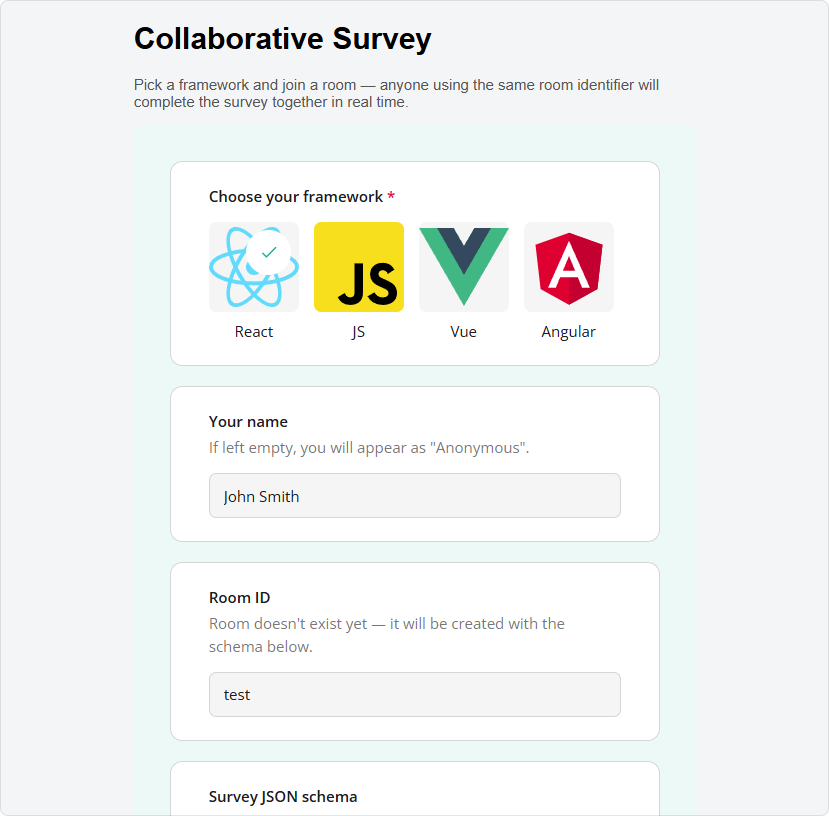
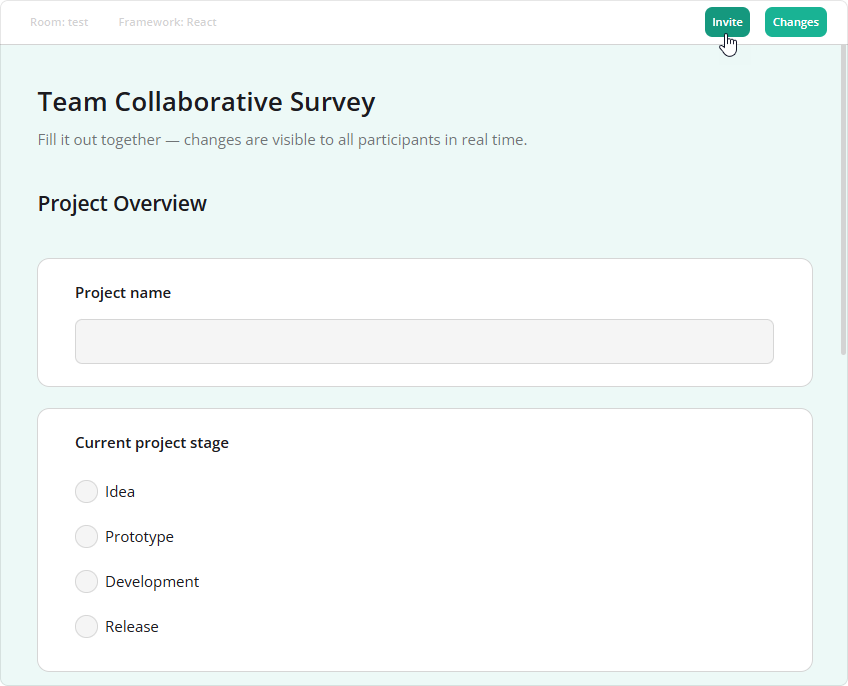
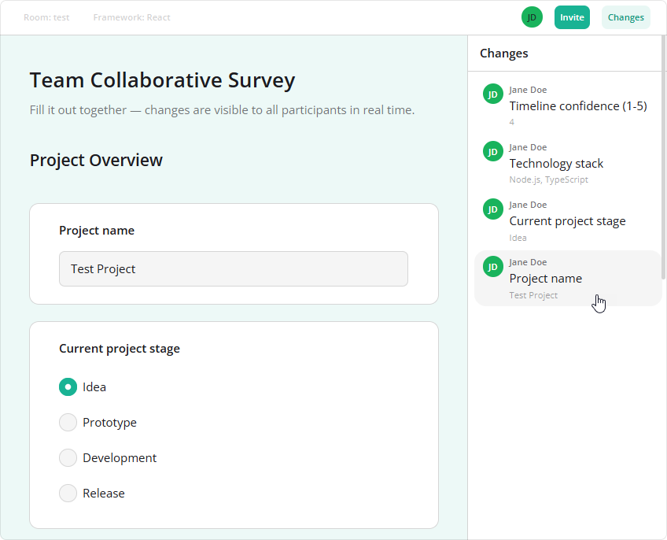

# Collaborative Form Filling by SurveyJS

This app lets several people fill out the same [SurveyJS](https://surveyjs.io/) form together. Answers and uploaded files are shared in real time. Participants can use clients built with React, plain JavaScript, Vue, or Angular to work in the same room.

[Open the Online Demo](https://collaborative-form-filling.demos.surveyjs.io/)

## Try It Locally

Install the dependencies, build the clients, and start the server:

```bash
npm install
npm run build
npm run dev
```

Open [localhost:3001](http://localhost:3001). In the lobby, enter your name, choose a framework, and enter a room ID. Use the sample form or paste a SurveyJS JSON schema to create a room with your own form.



Once you join, click **Invite** to copy a link for another participant. To try collaboration on your own, open the link in a second browser tab.



As participants fill out the form, everyone can see their answers, which questions they are working on, and where their cursors are. Click a participant's avatar to jump to their question. Open **Changes** to review edits and jump to the affected questions.



## How It Works

- Each client creates a SurveyJS form and attaches `CollaborationPlugin` from `survey-core`. The plugin provides the participants bar, presence indicators, and change history. See the [React client](clients/react/src/App.tsx) for an example.
- The shared [connection helper](shared/collab-client.ts) sends plugin messages over WebSocket, passes incoming messages to the plugin, and reconnects if the connection drops.
- [File handling](shared/fileSync.ts) uploads files separately so that their links can be shared as answers.
- The server stores each room's answers and forwards changes to its participants. If two people edit the same answer, the last change received wins.
- The server does not depend on SurveyJS. [PROTOCOL.md](PROTOCOL.md) describes how to implement a compatible server.

### Limitations

- Rooms are stored in memory and deleted shortly after everyone leaves. Restarting the server also clears them.
- Edits made while offline are lost when the connection is restored.
- Change history covers only the current connection.
- There is no authentication.

## Use the Collaboration Plugin

To use `CollaborationPlugin`, import it from `survey-core/collaboration`, create a survey model, and attach the plugin. In this example, `surveyJson` is your form definition, `roomId` identifies the shared room, and `inviteUrl` is its join link:

```ts
import { Model } from "survey-core";
import { CollaborationPlugin } from "survey-core/collaboration";
import "survey-core/survey-core.css";
import "survey-core/collaboration.css";

const survey = new Model(surveyJson);
const collab = new CollaborationPlugin(survey, {
  info: [{ label: "Room", value: roomId }],
  getInviteLink: () => inviteUrl,
});

// Forward plugin events through your WebSocket connection.
collab.onEvent.add((_, { message }) => {
  if (ws.readyState === WebSocket.OPEN) {
    ws.send(JSON.stringify(message));
  }
});

// Apply messages from the server, including the initial room state.
ws.onmessage = (event) => collab.apply(JSON.parse(event.data));
```

Here, `ws` is a WebSocket connected to a server that follows the [collaboration protocol](PROTOCOL.md). Attach the message handler before the server sends the initial room state, then render `survey` with your framework's SurveyJS component.

When you remove the form, call `collab.dispose()` and close the connection. In this app, [`connectCollab`](shared/collab-client.ts) handles message forwarding, reconnection, and cleanup. The [React client](clients/react/src/App.tsx) shows how to use it.

## Development

### Work on the Collaboration Plugin

The plugin source is in [`survey-library`](https://github.com/surveyjs/survey-library). To work on it locally, place a checkout next to this repository and build its packages. Run these commands from the `survey-library` directory:

```bash
cd packages/survey-core
npm run build
npm run build:collaboration
cd ../survey-react-ui
npm run build
cd ../survey-js-ui
npm run build
cd ../survey-vue3-ui
npm run build
```

In this repository, `npm run dev` and `npm test` use the local builds when available. Set `SURVEY_LIBRARY` to the path of a different checkout, or to `npm` to use the published packages. The server log shows which packages are in use.

Production builds and clients always use npm packages.

The development server serves the clients' built files, so run `npm run build` after changing a client.

### Run Tests

Run the server and client unit tests:

```bash
npm test
```

For browser tests, install Playwright browsers once and build the clients before running the suite:

```bash
npm run test:e2e:install
npm run build
npm run test:e2e
```

The plugin's own tests are in `../survey-library/packages/survey-core/tests/collaboration/`.

## Build and Run

Build all clients and the server, then start the production server:

```bash
npm run build
npm start
```

The server uses port `3001` by default. Set these environment variables to adjust its behavior:

| Variable | Default | Purpose |
| --- | --- | --- |
| `PORT` | `3001` | HTTP and WebSocket port |
| `EMPTY_ROOM_TTL_MS` | `2000` | Delay before deleting an empty room, in milliseconds |
| `PRESENCE_PING_MS` | `30000` | WebSocket keepalive interval, in milliseconds |

## Related Resources

- [SurveyJS Website](https://surveyjs.io/)
- [SurveyJS Documentation](https://surveyjs.io/documentation)
- [What's New in SurveyJS](https://surveyjs.io/WhatsNew)
